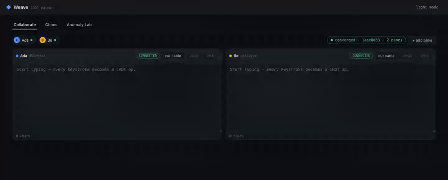
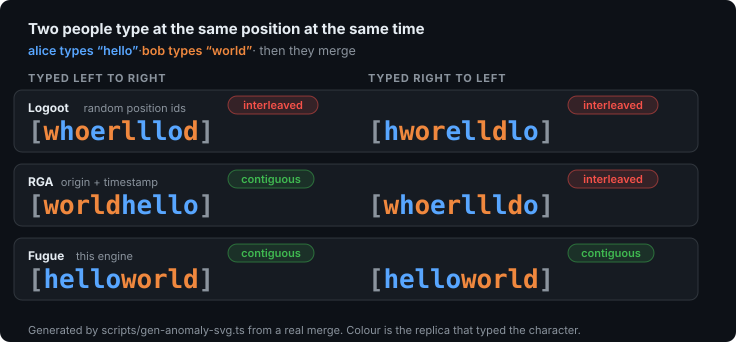
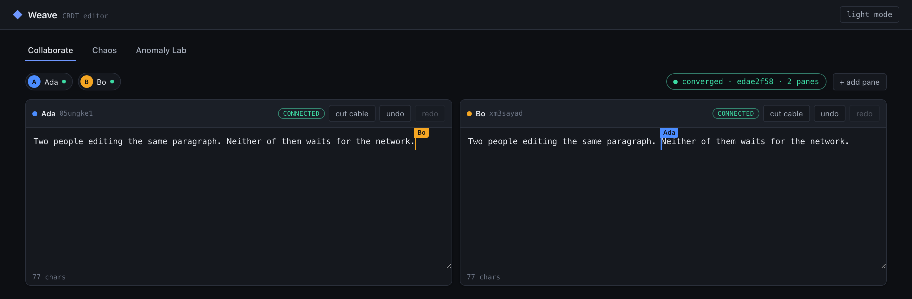
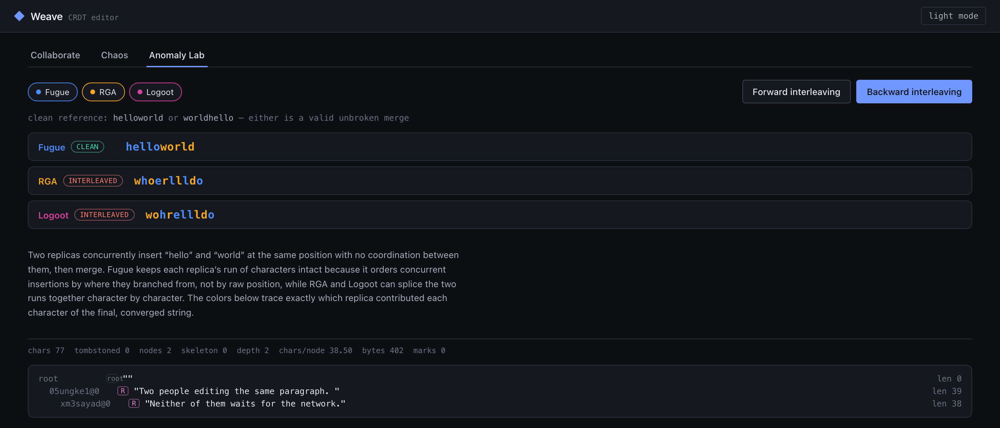
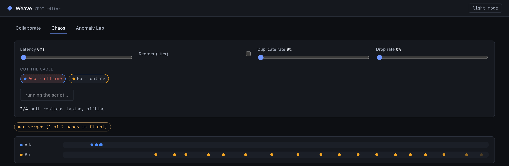

# LiveDoc

**A CRDT engine for real-time collaborative editing.** Two people type at the
same position at the same time, neither waits for the network, and both end up
with the same document — with the text each of them actually wrote.




<p align="center"><em>Two replicas typing together, the anomaly comparison, then one of them cut
off entirely — edits stacking up with nowhere to go — and the merge when the
connection comes back. Recorded from the running app, not staged.</em></p>


**If you only read three things:** [the anomaly this
avoids](#the-question-this-project-answers) · [how convergence is
established](#correctness) · [what it cannot do](#limits-stated-up-front).

---

## The question this project answers

*What happens when two people type at the same position at the same time?*

Every collaborative editor has to answer it. The tempting answer — "the merge
converges, so we're fine" — is not enough, because a merge can converge on text
nobody wrote:



Alice types `hello`, Bob types `world`, at the same position, at the same
moment. All three algorithms above converge. Only one of them produces text a
human would recognise.

That picture is generated by `scripts/gen-anomaly-svg.ts` from a real merge —
the colour of each character is the replica that typed it, read out of the
engine, not annotated by hand. The same comparison runs as a test:
[`interleaving.anomaly.test.ts`](packages/core/test/interleaving.anomaly.test.ts).

**Why the two columns differ.** Typing left to right and typing right to left
are different problems. Forward, each character's anchor is the character
before it, so a run forms a chain and stays whole. Backward, every character in
the run shares one anchor, so in RGA the run collapses into a single
timestamp-ordered sibling list and two concurrent runs shuffle together. Fugue
lets a character anchor to the *left* of its successor as well as to the right
of its predecessor, which turns a backward run into a subtree — and a subtree
is contiguous in an in-order traversal. That one extra case is the whole
difference. [DESIGN.md §2](DESIGN.md) works through it.

---

## What is in here

```
packages/core     the engine — Fugue sequence CRDT, GC, rich text, undo
packages/server   a WebSocket relay that never parses a CRDT payload
packages/editor   a multi-client editor with live cursors and a chaos panel
packages/bench    benchmarks against Yjs and Automerge
```

```
     replica A                     replica B
    local edit                    local edit
        │                              │
   apply immediately            apply immediately   ◄── never blocks on the network
        │                              │
        └────────► operations ◄────────┘
                        │
          merge — commutative, associative, idempotent
                        │
        identical state on both, whatever the arrival order
```

### The engine

- **Fugue sequence CRDT** (Weidner, Toomim & Kleppmann 2023) — no interleaving
  in either direction
- **Run-length compressed nodes** — a typed 2,000-character paragraph is one
  tree node, not 2,000
- **Tombstone garbage collection** gated on causal stability, with the part it
  cannot reclaim documented rather than rounded away
- **Rich text** with Peritext-style sticky anchors — a bold range survives
  concurrent edits inside and above it
- **Undo and redo under concurrency** — undoing your delete does not resurrect
  text a collaborator also deleted
- **Live cursors and presence**, deliberately outside the CRDT
- **Binary wire encoding** with LEB128 varints and an interned replica table
- **No operation log.** Insert operations are regenerated from the tree on
  demand, so garbage collection actually frees memory instead of trading a
  tombstone for a log entry

---

## Try it

```bash
npm install
npm run build                # build the core
npm test                     # 90 core tests, including the property tests
npm run dev                  # relay on :8787 + editor on :5173
```

Open the editor in two browser windows and type in both. Or open one window and
use the panes — the **Chaos** tab lets you add latency, reorder and duplicate
messages, drop them, and cut a replica's connection entirely; the **Anomaly
Lab** runs the interleaving scenario live against all three algorithms.

The editor works with no server running at all — it falls back to an in-browser
loopback transport and says so.

```bash
npm run test:all             # 95 tests: 90 in the core, 5 against the relay
npm run bench                # the full comparison against Yjs and Automerge
npm run bench:quick          # a fast pass
npm run assets               # regenerate the interleaving figure from a real merge
```

<table>
<tr>
<td width="50%"></td>
<td width="50%"></td>
</tr>
<tr>
<td align="center"><em>Live cursors and presence across replicas</em></td>
<td align="center"><em>The anomaly lab, with per-character attribution</em></td>
</tr>
</table>



<p align="center"><em>Mid-partition. Ada is cut off and her edits are stacking up with nowhere to go;
Bo is still sending. The badge says diverged, honestly, because it is.</em></p>

Every image above is captured from the running app by `scripts/capture.mjs`,
driven through the real UI against a real relay. The script aborts rather than
capture a frame that would misrepresent what happened.

---

## Correctness

A CRDT that converges *usually* is worthless, so convergence is established by
generated evidence rather than by argument.

| What is checked | How | Where |
| --- | --- | --- |
| Convergence over random histories | property-based, 2–5 replicas, random delivery | [`convergence.property.test.ts`](packages/core/test/convergence.property.test.ts) |
| Non-interleaving in general | property-based, 2–5 replicas, both directions | same file |
| Idempotence and commutativity | every update replayed, and in two shuffled orders | same file |
| Behaves like a plain string | single-replica differential against JavaScript `String` | same file |
| The named anomalies | three algorithms, same input, one test per failure mode | [`interleaving.anomaly.test.ts`](packages/core/test/interleaving.anomaly.test.ts) |
| Reorder, duplicate, drop, partition | network fuzzing with a seeded adversarial transport | [`network.fuzz.test.ts`](packages/core/test/network.fuzz.test.ts) |
| Agreement with a mature implementation | differential testing against Yjs | [`differential.test.ts`](packages/core/test/differential.test.ts) |
| GC cannot strand a peer | insert anchored next to a collected tombstone | [`gc.test.ts`](packages/core/test/gc.test.ts) |
| Undo under concurrent deletes | your undo, their delete | [`undo.test.ts`](packages/core/test/undo.test.ts) |

Property tests run **1,650 generated histories** per run, and `fast-check`
shrinks any counterexample to a minimal failing history — which is most of why
they are worth writing this way.

**On the differential tests.** Exact string equality is asserted only where the
answer is *forced*: one replica editing, or replicas that always sync before
editing again. Under genuine concurrency, Yjs and Fugue may legitimately order
two independent runs differently, and asserting equality there would be
asserting that LiveDoc is Yjs. The concurrent tests assert what is actually
forced — the same multiset of characters with no deletes in play, the same
length with them, and internal convergence in both libraries.

---

## Benchmarks

**Apple M3 Pro · arm64 · Node v24.2.0 · yjs 13.6.32 · @automerge/automerge 3.4.1 · seed 42**

Every number below comes from one run, committed in full at
[`packages/bench/results/latest.md`](packages/bench/results/latest.md)
alongside the raw JSON. Ratios are printed as **LiveDoc / Yjs**, so a number
above 1.0 always means LiveDoc is worse.

**Losing to Yjs is expected.** It is years of specialist optimisation by people
who do this full time. Parity on memory and wire size, and the same order of
magnitude on merge latency, is the result being claimed.

### Insert latency vs document size

The workload is random-position inserts — nothing can be cached, so the index
structure is doing real work. Median of 30 sampled inserts at each checkpoint,
after a warm-up pass, with the first 20% of samples discarded.

| Document size | LiveDoc | Yjs | Automerge |
| --- | --- | --- | --- |
| 1,000 | 0.0018 ms | 0.0026 ms | 0.034 ms |
| 16,000 | 0.0031 ms | 0.0038 ms | 0.036 ms |
| 128,000 | 0.0053 ms | 0.056 ms | 0.046 ms |
| 512,000 | 0.010 ms | 0.278 ms | 0.104 ms |

No library crosses 1 ms per insert within a 512,000-character document, so none
of them has a "degradation point" on this machine at this scale — that is the
honest answer to *where does it fall over*, and it is not the answer I expected
to be able to give.

LiveDoc's curve flattens because it descends a tree with subtree-size counters,
while Yjs walks a linked list from a cached position — a known characteristic
of Yjs on random-access workloads, not something anyone missed. Tree depth is
43 at 200,000 characters.

**How much faster, honestly.** Across repeated runs on this machine, LiveDoc
lands at 0.010–0.017 ms at 512,000 characters and Yjs at 0.173–0.278 ms. That
is somewhere between 10× and 28× depending on the run. **The ordering and the
widening gap are stable across every measurement; the multiple is not**, so
this reports the range rather than picking the flattering end of it.

**And one measurement was thrown away entirely.** The *throughput* form of this
same workload swung between 3.7× and 13.4× across seeds, with LiveDoc's own
absolute figure moving by a factor of twenty. No speedup number from it is
reported at all.

### Wire size

Bytes actually sent per local edit, over a 10,000-operation realistic editing
session — the per-transaction update a provider emits, not a state-vector diff:

| | bytes/op | ratio |
| --- | --- | --- |
| LiveDoc | 23.84 | 0.95× |
| Yjs | 25.15 | baseline |
| Automerge | 100.6 | — |

Parity. Run-length compression and an interned replica table get the binary
encoding to roughly where `lib0` already is.

**This suite had a reproducibility bug worth describing**, because it is the
kind that quietly decides a benchmark. Yjs writes its `clientID` as a varint
into every struct it encodes, and `Y.Doc` draws that id at random — so the same
2,000 appends cost 23,744 bytes at clientID `7` and 39,740 at clientID `1e9`.
Left random, this comparison was partly measuring a coin flip, and its ratio
landed on either side of parity depending on the draw. The adapter now derives
the id deterministically from the replica name, still spread across the full
uint32 range a real client draws from, so the number is reproducible without
being flattered by an unrealistically small id.

### Merge latency

Applying a 200-operation concurrent batch into a document of a given size:

| Document size | LiveDoc | Yjs | Automerge | ratio |
| --- | --- | --- | --- | --- |
| 1,000 | 0.118 ms | 0.150 ms | 3.28 ms | 0.79× |
| 10,000 | 0.060 ms | 0.069 ms | 4.82 ms | 0.87× |
| 100,000 | 0.070 ms | 0.070 ms | 30.3 ms | 1.00× |
| 200,000 | 0.118 ms | 0.075 ms | 61.2 ms | 1.58× |

Yjs wins at the top end. This is the noisiest suite here: the 200,000-character
gap moved between 1.6× and 3.2× across runs on this machine, so read it as
"same order of magnitude, Yjs ahead", not as 1.58×.

### Tombstone GC

A 50,000-character document with 25,000 characters deleted, collected once the
delete is causally stable across every peer:

| | before | after |
| --- | --- | --- |
| structure bytes | 98.1 KB | 49.3 KB |
| deleted characters still holding text | 25,000 | 0 |

100% of deleted character *text* is reclaimed. The identities are not — see
below.

---

## Limits, stated up front

Known limitations are what make the rest believable, so they are in the README
rather than only in the design doc.

- **Garbage collection frees text, not positions.** A tombstone's id is kept
  forever, because "causally stable" only means nothing concurrent is still in
  flight — a replica may still insert next to that tombstone tomorrow and name
  it as an anchor. Removing it would strand any replica that had not. The floor
  is one node header per distinct deleted run, and the benchmark reports it.
- **Delete records are compacted, not removed.** Their target lists are
  reclaimed; the records themselves stay, because a delete consumes a counter
  and removing it would permanently block every later operation from that
  author. So "no operation log" is precise, not loose: *inserts* are not
  logged. Deletes are. [DESIGN.md §6](DESIGN.md) has the two failures that
  taught me this.
- **Backward runs are not run-length compressed.** A long right-to-left run
  becomes a left-child chain of depth O(n). Forward runs — overwhelmingly the
  common case — compress to a single node.
- **The undo horizon equals the GC horizon.** An entry cannot be undone once
  its operations fall below the collection frontier.
- **Mark resolution is not incremental**: O(marks × spans) per render. Fine for
  tens of marks, not for thousands.
- **The relay has no auth and no persistence**, and presence is not
  authenticated. That is deliberate scope: a CRDT that needs a clever server is
  not doing its job, and the server here never parses a CRDT payload.
- **Benchmarks are single-process Node measurements on one machine.** They
  measure the merge algorithm, not a distributed system.

---

## Reading further

- **[DESIGN.md](DESIGN.md)** — why Fugue over OT, RGA and Logoot; the tree and
  its invariant; why sibling order is arbitrary; how GC stays safe; why undo is
  an OR-Set; and every limit above, argued rather than asserted.
- **[packages/core/README.md](packages/core/README.md)** — the engine's own
  documentation, with the API worked through by example.
- **[packages/server/README.md](packages/server/README.md)** — the relay, the
  wire protocol, and the resume path that makes chaos recoverable.
- **[packages/editor/README.md](packages/editor/README.md)** — caret
  preservation under remote edits, which is fiddlier than it sounds.
- **[packages/bench/README.md](packages/bench/README.md)** — what each suite
  measures and the caveats on each number.
- **[docs/API_CONTRACT.md](docs/API_CONTRACT.md)** — the API surface and the
  wire protocol.

### Papers this is built on

- Weidner, Toomim & Kleppmann, *The Art of the Fugue: Minimizing Interleaving in
  Collaborative Text Editing* (2023)
- Litt, Lim, Kleppmann & van Hardenberg, *Peritext: A CRDT for Rich-Text
  Collaboration* (2022)
- Roh, Jeon, Kim & Lee, *Replicated Abstract Data Types* (2011) — RGA
- Weiss, Urso & Molli, *Logoot* (2009)
- Kleppmann & Beresford, *A Conflict-Free Replicated JSON Datatype* (2017) —
  causal stability

MIT licensed.
